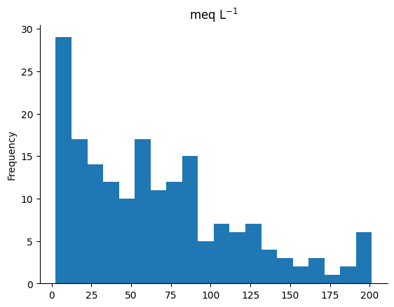
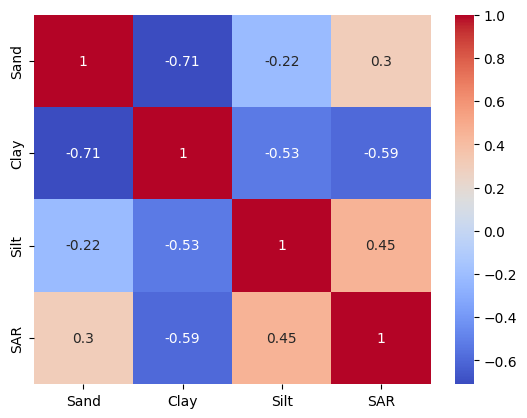
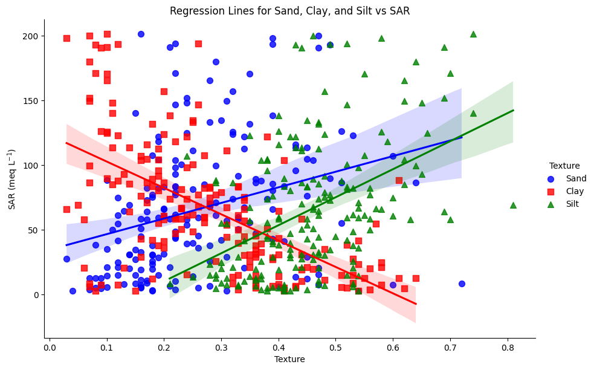
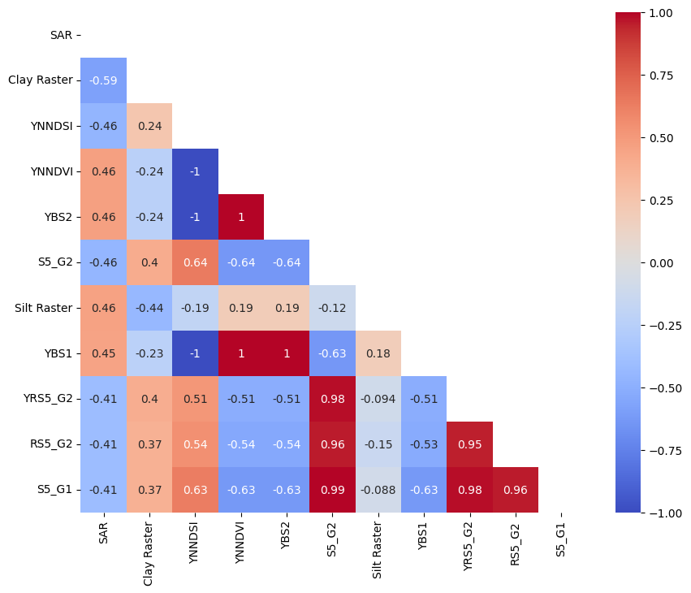
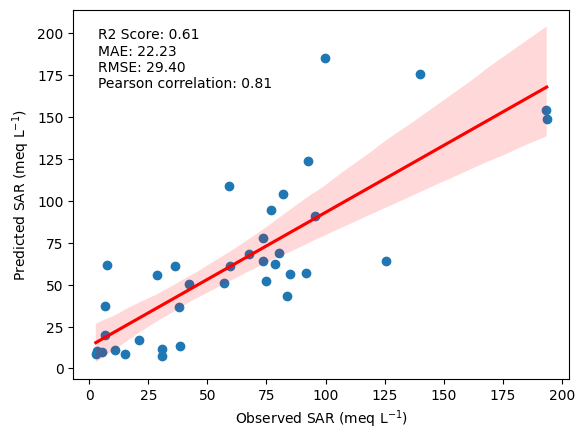
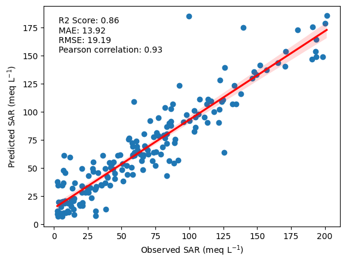
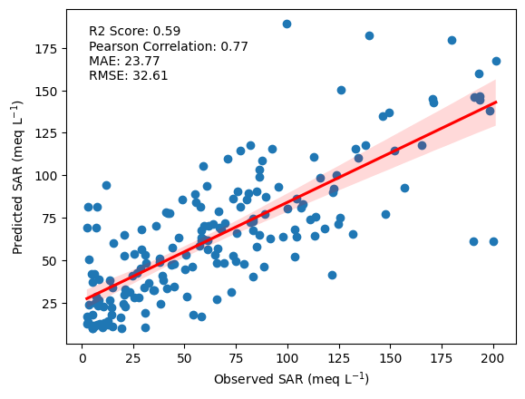
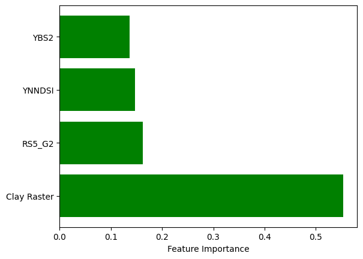

# **Final work report**

# Introduction

The research focuses on the problem of soil salinity in rice production areas within mangroves, specifically in Guinea-Bissau, West Africa. This issue is of paramount importance due to the vital role of rice in the local diet and the significant impact of soil salinity on agricultural productivity in the region (Balasubramanian et al., 2007; Nations, 2018). Compounded by unpredictable rainfall patterns and inadequate diagnostic methods, the management of soil salinity poses a considerable challenge, underscoring the urgent need for innovative approaches (Garbanzo et al., 2024; Mendes & Fragoso, 2023). Leveraging satellite imagery and machine learning algorithms offers a promising solution to address this complex issue and enhance agricultural practices in rice production (Chuvieco, 2009; Wu et al., 2018).

## Data Section

### Data Sources

**Soil sampling of the Cafine area, Tombali Region, Guinea Bissau**: 183 soil samplings were conducted during May 2022, with a clear spatial location of each sampling (Figure 1A and Figure 1B). For modeling, Sodium Absorption Ratio (SAR) data were considered.
 

  
   
  <strong>Figure 1:</strong> General location of the study area (A). Location and distribution of soil sampling (B).

**PlanetScope sensor data**: The image with the lowest cloud cover was downloaded for May 2022, specifically on 2022-05-28. The PlanetScope (PS) sensor has a spatial resolution of 3x3m. For more details, visit [PlanetScope Bands](https://developers.planet.com/docs/apis/data/sensors/).

Subsequently, a series of salinity mapping-oriented vegetation indices was created (see [Index_table.md](Markdown_tables/Index_table.md)).

**Interpolated texture data**: Sand, silt, and clay data were interpolated by ordinary kriging to spatially make available texture data from the study area, using the procedure from the work of [Garbanzo et al. 2024](https://doi.org/10.3390/agronomy14020335).

### Description of Sodium Absorption Ratio (SAR) Sampling Data

SAR data show high salinity conditions in the study area, with concentrations up to 200 meq L^-1 (Figure 2).

 
  
<strong>Figure 2:</strong> Cumulative SAR soil sampling frequencies for the study area.

When correlating the SAR data with the textural variables, a negative relationship with clay of about -0.59 was found (Figure 3).

 
  
<strong>Figure 3:</strong> Correlation between SAR data and soil texture.

This trend is shown in the scatterplot of the data grouped thematically by texture type associated with each sampling (Figure 4).

 
  
<strong>Figure 4:</strong> Scatter plot of SAR data with soil texture.

### Selection of Indices for Modeling

For the extraction of the index information, a 6m buffer was applied over the sampling points. Subsequently, the area statistics function was applied to each index to obtain the median of the values of each buffer. This methodology was based on that applied in a similar study by [Wu et al. 2018](https://doi.org/10.1002/ldr.3148).

Once these index data were extracted and correlated with SAR values, those with the 10 highest correlations were selected (Figure 5). Subsequently, considering the indices with similar origin in spectral terms and similar correlations, the YNNDSI, Clay-Raster, YBS2 and RS5_G2 indices were selected to model the data.

 
  
<strong>Figure 5:</strong> Top 10 highest correlations between vegetation indices and SAR.

### Data Storage in Google Earth Engine (GEE) and Google Drive

The satellite data and texture interpolated data were stored in GEE to facilitate the process of calculating the vegetation indices and processing them using the Python programming language. This call from GEE was performed using the Earth Engine and [GeeMap](https://geemap.org/) libraries. Subsequently, all the results of these processes stored in Google Drive were called to the local environment using the PyDrive library.

## Data organization

- **Training Set**: Used to train the model.
- **Validation Set**: Used to adjust the model's hyperparameters and evaluate its performance during training to avoid overfitting.
- **Test Set**: Used to evaluate the final performance of the model on unseen data.

## Methods.

### CNN (Convolutional Neural Network)

**Architecture**:
- Input Layer: Number of features equal to the input size.
- Convolutional Layer: 1D convolution with a kernel size of 3 and 32 filters.
- Batch Normalization: Applied after the convolutional layer.
- Activation Function: ReLU.
- Pooling Layer: MaxPooling with a kernel size of 2.
- Fully Connected Layers: Three hidden layers with 32 units each followed by batch normalization and ReLU activation.
- Dropout: Applied with a probability of 0.01.
- Output Layer: Single neuron for regression output.

**Hyperparameters**:
- Apprenticeship Rate: 0.1
- Epochs: 50
- Batch Size: 32
- Optimizer: Adagrad
- Loss Function: Smooth L1 Loss
- Regularization: 0.1 % weight decay.

### RF (Random Forest Regressor).

**Architecture**:
- Number of Trees (Estimators): 100
- Criterion: Squared error
- Minimum Number of Samples to Split: 2
- Random State: 27

**Hyperparameters**:.
- Scaler: StandardScaler for feature normalization.
- Random State: 65 for training-test splitting.
- Evaluation Metrics: R2 Score, Mean Absolute Error (MAE), Root Mean Square Error (RMSE), Pearson's Correlation.

In this RF modeling process, the scaler result was saved during the training process to ensure consistency between training data and prediction data. The standardization method `StandardScaler` from the `scikit-learn` library was used. This scaler was saved and subsequently applied to the input raster before predictions were made, ensuring that the raster features were transformed consistently with the training data, which is crucial for model accuracy (Pedregosa et al. 2011).

The choice of architecture for CNN-1D involved testing different hidden layers and nodes per iteration and running the model. Similarly, in the case of the RF, different parameters and number of estimators were tested in order to observe the behavior of the model and its performance (it was run starting at 50 trees and going up to 1000 using an interval of 50 trees). Different optimizers such as SGD, Adam, RMSProp, Rprop, among others, were also tested, determining that Adagrad showed the best results. Given the range of high values in the input data (Figure 2), Adagrad adjusts the learning rate for each parameter individually, assigning a higher rate to parameters with less frequent gradients and a lower rate to those with more frequent gradients (Duchi et al. 2012), which could explain its better performance.

## Results

The results of the RF model on the test set (20% of the samples) show a predictive ability of 62% according to the regression coefficient, with Mean Absolute Error (MAE) and Root Mean Squared Error (RMSE) values of 22.58 and 29.11 respectively, which is acceptable given the high salinity conditions and the range of data in the study area (Figure 6).

 
  
<strong>Figure 6:</strong> Regression between observed and predicted values of SAR values for test data.

Evaluating the model on all observed data, equally acceptable behavior is observed with good predictive ability and lower RMSE and MAE errors comparatively to the test data (Figure 7).

 
  
<strong>Figure 7:</strong> Regression between observed and predicted values of SAR values for all data.

The prediction on the spatial raster data (with the indices selected in 2.3) shows a regression coefficient of 59% and comparatively higher RMSE and MAE values than those in Figures 6 and 7, but still within an acceptable range. Spatially, it shows correspondence between sampling and observed field experience ('bolahna' salty and sweet) (Figure 8).

 
  
<strong>Figure 8:</strong> Regression between observed and predicted values on raster data of SAR values for all data.

The RF results showed that, among the input data, the textural interpolated data of clays contributed the most in the model (Figure 9), followed by RS5_G2 (created using the blue, red edge and green bands), YNNDSI (created using the red and yellow bands) and YBS2 (created with the yellow and red bands in a normalized index).

 
  
<strong>Figure 9:</strong> Importances of the input variables in the RF model.

The spatial distribution of the model output is shown in Figure 10, where it is possible to observe a good correspondence between the soil sampling data (Figure 10A) and the spatial distribution of salinity (Figure 10B).

 
  
<strong>Figure 10:</strong> Display of point data from soil sampling (A). Mapping of salinity over selected indices (created from PS image)(B).

## Analysis
The results show that the RSG5_G2 index, derived from satellite data, was one of the most important in the Random Forest (RF) modeling (Figure 9). In addition, it presented a moderate correlation with electrical conductivity (EC) (Figure 5). This agrees with the research of Tan et al. (2023), which highlights the indices and the red-edge spectral band as relevant for predicting soil salinity. This same pattern is observed in the yellow band used in the YNNDSI.

Soil texture is one of the factors included in this study and showed a great influence on both data correlation and modeling. This agrees with Fourati et al. (2017), who mention soil texture as one of the aspects most related to the spatial distribution of soil salinity.

Regarding the coefficient of determination (R²) results, considering a study with the same satellite sensor (PlaneScope), the values obtained during the test phase were approximately 62%. These results are like those reported by Tan et al. (2023), with an R² of 56%. Similarly, Naimi et al. (2021) obtained accuracies around 48%, and Mzid et al. (2023) reported an R² close to 67%. These studies agree that the RF method is an effective method for soil salinity mapping.

## References

- Balasubramanian, V., Sie, M., Hijmans, R. J., & Otsuka, K. (2007). Increasing Rice Production in Sub-Saharan Africa: Challenges and Opportunities. Advances in Agronomy, 94, 55–133. [https://doi.org/10.1016/S0065-2113(06)94002-4](https://doi.org/10.1016/S0065-2113(06)94002-4)
- Chuvieco, E.(2009). Fundamentals of satellite remote sensing. In Fundamentals of Satellite Remote Sensing. [https://doi.org/10.1201/b18954](https://doi.org/10.1201/b18954)
- Duchi, J. C., Bartlett, P. L., & Wainwright, M. J. (2012). Randomized smoothing for (parallel) stochastic optimization. Proceedings of the IEEE Conference on Decision and Control, 12, 5442–5444. [https://doi.org/10.1109/CDC.2012.6426698](https://doi.org/10.1109/CDC.2012.6426698)
- Fourati, H. T., Bouaziz, M., & Benzina, M. (2017). Detection of terrain indices related to soil salinity and mapping salt-affected soils using remote sensing and geostatistical techniques. [https://doi.org/10.1007/s10661-017-5877-7](https://doi.org/10.1007/s10661-017-5877-7)
- Garbanzo, G., Céspedes, J., Sandoval, J., Temudo, M., Paredes, P., & Cameira, M. do R. (2024). Moving toward the Biophysical Characterization of the Mangrove Swamp Rice Production System in Guinea Bissau: Exploring Tools to Improve Soil- and Water-Use Efficiencies. Agronomy 2024, Vol. 14, Page 335, 14(2), 335. [https://doi.org/10.3390/AGRONOMY14020335](https://doi.org/10.3390/AGRONOMY14020335)
- Mendes, O., & Fragoso, M. (2023). Assessment of the Record-Breaking 2020 Rainfall in Guinea-Bissau and Impacts of Associated Floods. Geosciences 2023, Vol. 13, Page 25, 13(2), 25. [https://doi.org/10.3390/GEOSCIENCES13020025](https://doi.org/10.3390/GEOSCIENCES13020025)
- Mzid, N., Boussadia, O., Albrizio, R., Stellacci, A. M., Braham, M., & Todorovic, M. (2023). Salinity Properties Retrieval from Sentinel-2 Satellite Data and Machine Learning Algorithms. Agronomy, 13(3), 1–19. [https://doi.org/10.3390/agronomy13030716](https://doi.org/10.3390/agronomy13030716)
- Naimi, S., Ayoubi, S., Zeraatpisheh, M., & Dematte, J. A. M. (2021). Ground observations and environmental covariates integration for mapping of soil salinity: A machine learning-based approach. Remote Sensing, 13(23), 1–21. [https://doi.org/10.3390/rs13234825](https://doi.org/10.3390/rs13234825)
- Nations, F. and A. O. of the U. (2018). FAO Rice Market Monitor | FAO | Food and Agriculture Organization of the United Nations. [https://www.fao.org/markets-and-trade/commodities/rice/rmm/en/](https://www.fao.org/markets-and-trade/commodities/rice/rmm/en/)
- Pedregosa, F., Varoquaux, G., Gramfort, A., Michel, V., Thirion, B., Grisel, O., Blondel, M., Prettenhofer, P., Weiss, R., Dubourg, V., Vanderplas, J., Passos, A., & Cournapeau, D. (2011). Scikit-learn: Machine Learning in Python Fabian. Journal of Machine Learning Research, 12(9), 2825–2830.
- Tan, J., Ding, J., Han, L., Ge, X., Wang, X., Wang, J., Wang, R., Qin, S., Zhang, Z., & Li, Y. (2023). Exploring PlanetScope Satellite Capabilities for Soil Salinity Estimation and Mapping in Arid Regions Oases. Remote Sensing, 15(4). [https://doi.org/10.3390/rs15041066](https://doi.org/10.3390/rs15041066)
- Wu, W., Zucca, C., Muhaimeed, A. S., Al-Shafie, W. M., Fadhil Al-Quraishi, A. M., Nangia, V., Zhu, M., & Liu, G. (2018). Soil salinity prediction and mapping by machine learning regression in Central Mesopotamia, Iraq. Land Degradation & Development, 29(11), 4005–4014. [https://doi.org/10.1002/LDR.3148](https://doi.org/10.1002/LDR.3148)
