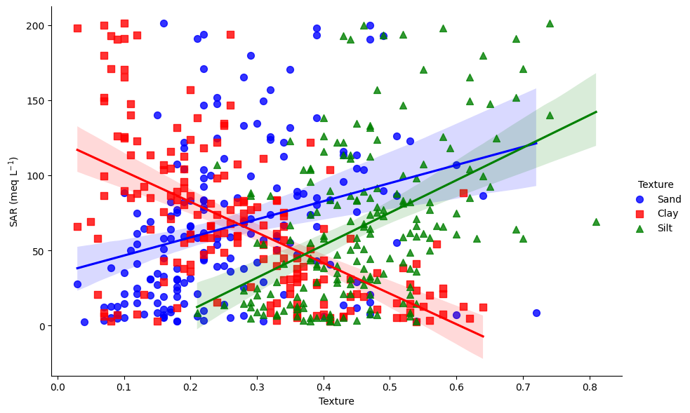

# **Final work report**

# Introducción

The research focuses on the problem of soil salinity in rice production areas within mangroves, specifically in Guinea-Bissau, West Africa. This issue is of paramount importance due to the vital role of rice in the local diet and the significant impact of soil salinity on agricultural productivity in the region ([Balasubramanian et al., 2007](https://doi.org/10.1016/S0065-2113(06)94002-4); [Food and Agriculture Organization of the United Nations, 2018](https://www.fao.org/markets-and-trade/commodities/rice/rmm/en/)). Compounded by unpredictable rainfall patterns and inadequate diagnostic methods, the management of soil salinity poses a considerable challenge, underscoring the urgent need for innovative approaches ([Mendes and Fragoso, 2023](https://doi.org/10.3390/geosciences13020025); [Garbanzo et al., 2024](https://doi.org/10.3390/agronomy14020335)). Leveraging satellite imagery and machine learning algorithms offers a promising solution to address this complex issue and enhance agricultural practices in rice production ([Chuvieco, 2020](https://doi.org/10.1201/9780429506482); [Wu et al., 2018](https://doi.org/10.1002/ldr.3148)).

## Sección de Datos

### Fuentes de los Datos

**Muestreos de suelos del área de Cafine, Región de Tombalí, Guinea Bissau**: Se realizaron 183 muestreos de suelos durante mayo de 2022, con una ubicación espacial clara de cada muestreo (Figura 1A y Figura 1B). Para el modelado, se consideraron los datos de la Razón de Absorción de Sodio (SAR).
 
<image src="Final_work/Images_report/Figura1.png" alt="Location map" caption="Figura 1: Ubicación general del área de estudio (A).Localización y distribución de los muestreos de suelos (B).">

**Datos del sensor PlanetScope**: Se descargó la imagen con menor nubosidad del mes de mayo de 2022, específicamente el día 2022-05-28. El sensor PlanetScope (PS) cuenta con una resolución espacial de 3x3m. Para más detalles, visite [PlanetScope Bands](https://developers.planet.com/docs/apis/data/sensors/).

Posteriormente, se creó una serie de índices de vegetación orientados al mapeo de salinidad (ver [Index_table.md](Markdown_tables/Index_table.md)).

**Datos interpolados de textura**: Los datos de arenas, limos y arcillas fueron interpolados mediante kriging ordinario para disponibilizar espacialmente los datos de textura del área de estudio, utilizando el procedimiento del trabajo de [Garbanzo et al. 2024](https://doi.org/10.3390/agronomy14020335).

### Descripción de Datos de Muestreo de Razón de Absorción de Sodio (SAR)

Los datos de SAR muestran condiciones de alta salinidad en el área de estudio, con concentraciones de hasta 200 meq L^-1 (Figura 2).

Al correlacionar los datos de SAR con las variables texturales, se descubrió una relación negativa con la arcilla de cerca de -0.59 (Figura 3).

Esta tendencia se muestra en la figura de dispersión de los datos agrupados temáticamente por tipo de textura asociada a cada muestreo (Figura 4).

### Selección de los Índices para Modelado

Para la extracción de la información de los índices, se aplicó un buffer de 6m sobre los puntos de muestreo. Posteriormente, se aplicó la función de estadísticas de área a cada índice para obtener la mediana de los valores de cada buffer. Esta metodología se basó en lo aplicado en un estudio similar por [Wu et al. 2018](https://doi.org/10.1002/ldr.3148).

Una vez extraídos estos datos de los índices y correlacionados con los valores de SAR, se seleccionaron aquellos con las 10 correlaciones más altas (Figura 5). Posteriormente, considerando los índices con origen similar en términos espectrales y correlaciones similares, se seleccionaron los índices YNNDSI, Clay-Raster, YBS2 y RS5_G2 para modelar los datos.

### Almacenamiento de los Datos en Google Earth Engine (GEE) y Google Drive

Los datos satelitales y los datos interpolados de textura fueron almacenados en GEE para facilitar el proceso de cálculo de los índices de vegetación y su procesamiento mediante el lenguaje de programación Python. Este llamado desde GEE se realizó mediante las librerías de Earth Engine y [GeeMap](https://geemap.org/). Posteriormente, todos los resultados de estos procesos almacenados en Google Drive fueron llamados al entorno local mediante la librería PyDrive.

## Organización de Datos

- **Conjunto de Entrenamiento**: Utilizado para entrenar el modelo.
- **Conjunto de Validación**: Utilizado para ajustar los hiperparámetros del modelo y evaluar su rendimiento durante el entrenamiento para evitar el sobreajuste.
- **Conjunto de Prueba**: Utilizado para evaluar el rendimiento final del modelo en datos no vistos.

## Métodos

### CNN (Red Neuronal Convolucional)

**Arquitectura**:
- Capa de Entrada: Número de características igual al tamaño de la entrada.
- Capa Convolucional: Convolución 1D con un tamaño de kernel de 3 y 32 filtros.
- Normalización por Lotes: Aplicada después de la capa convolucional.
- Función de Activación: ReLU.
- Capa de Agrupamiento (Pooling): MaxPooling con un tamaño de kernel de 2.
- Capas Completamente Conectadas: Tres capas ocultas con 32 unidades cada una seguidas de normalización por lotes y activación ReLU.
- Dropout: Aplicado con una probabilidad de 0.01.
- Capa de Salida: Una sola neurona para salida de regresión.

**Hiperparámetros**:
- Tasa de Aprendizaje: 0.1
- Épocas: 50
- Tamaño de Lote: 32
- Optimizador: Adagrad
- Función de Pérdida: Smooth L1 Loss
- Regularización: Decaimiento de pesos de 0.1

### RF (Regresor de Bosque Aleatorio)

**Arquitectura**:
- Número de Árboles (Estimadores): 100
- Criterio: Error cuadrado
- Mínimo de Muestras para Dividir: 2
- Estado Aleatorio: 27

**Hiperparámetros**:
- Escalador: StandardScaler para normalización de características
- Estado Aleatorio: 65 para la división de entrenamiento-prueba
- Métricas de Evaluación: R2 Score, Error Absoluto Medio (MAE), Error Cuadrático Medio (RMSE), Correlación de Pearson

En este proceso de modelado de RF, se guardó el resultado del escalador durante el proceso de entrenamiento para garantizar la consistencia entre los datos de entrenamiento y los datos de predicción. Se utilizó el método de estandarización `StandardScaler` de la biblioteca `scikit-learn`. Este escalador fue guardado y posteriormente aplicado al raster de entrada antes de realizar las predicciones, asegurando que las características del raster sean transformadas de manera consistente con los datos de entrenamiento, lo cual es crucial para la precisión del modelo (Pedregosa et al. 2011).

La elección de la arquitectura para la CNN-1D involucró probar diferentes capas ocultas y nodos por iteración, y ejecutando el modelo. De igual forma, en el caso del RF, se probaron diferentes parámetros y número de estimadores con el fin de observar el comportamiento del modelo y su rendimiento (se ejecutó iniciando en 50 árboles y llegando hasta 1000 usando un intervalo de 50 árboles). También se probaron diferentes optimizadores como SGD, Adam, RMSProp, Rprop, entre otros, determinando que Adagrad mostró los mejores resultados. Dado el rango de valores altos en los datos de entrada (Figura 2), Adagrad ajusta la tasa de aprendizaje para cada parámetro de manera individual, asignando una tasa más alta a los parámetros con gradientes menos frecuentes y una tasa más baja a aquellos con gradientes más frecuentes (Duchi et al. 2012), lo que podría explicar su mejor rendimiento.

## Resultados

Los resultados del modelo RF sobre el conjunto de prueba (20% de los muestreos) muestran una capacidad de predicción del 62% según el coeficiente de regresión, con valores de Error Medio Absoluto (MAE) y Raíz Media Cuadrático del Error (RMSE) de 22.58 y 29.11 respectivamente, lo cual es aceptable dadas las condiciones de alta salinidad y el rango de datos en el área de estudio (Figura 6).

Al evaluar el modelo en todos los datos observados, se observa un comportamiento igualmente aceptable con una buena capacidad predictiva y errores de RMSE y MAE menores comparativamente con los datos de prueba (Figura 7).

La predicción sobre los datos espaciales del raster (con los índices seleccionados en el punto 2.3) muestra un coeficiente de regresión de 59% y valores de RMSE y MAE comparativamente más altos que los de las figuras 6 y 7, pero aún dentro de un rango aceptable. Espacialmente, muestra correspondencia entre los muestreos y la experiencia observada en campo (‘bolahna’ salada y dulce) (Figura 8).

Los resultados del RF mostraron que, entre los datos de entrada, los datos interpolados texturales de arcillas son los que más contribuyen en el modelo (Figura 9), seguidos del RS5_G2 (creado utilizando las bandas azul, borde rojo y verde), YNNDSI (creado utilizando las bandas roja y amarilla) y YBS2 (creado con las bandas amarilla y roja en un índice normalizado).

La distribución espacial del resultado del modelo se muestra en la figura 10, donde es posible observar una buena correspondencia entre los datos de los muestreos de suelo (Figura 10A) y la distribución espacial de la salinidad (Figura 10B).

